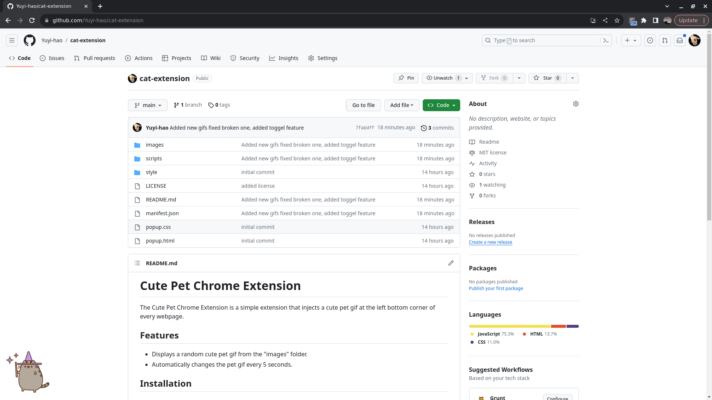

# Cute Pet Chrome Extension

The Cute Pet Chrome Extension is a simple extension that injects a cute pet gif at the left bottom corner of every webpage.

## Features

- Displays a random cute pet gif from the "images" folder.
- Automatically changes the pet gif every 5 seconds.

## Installation

1. Download or clone this repository.
2. Open Chrome and navigate to `chrome://extensions/`.
3. Enable "Developer mode" in the top-right corner.
4. Click "Load unpacked" and select the folder containing the extension files.

## Usage

Once the extension is installed:

- Open any webpage, and you should see a cute pet gif at the left bottom corner.
- The pet gif will change automatically every 5 seconds.
  
## DEMO 

## Folder Structure

- **images:** Contains cute pet gifs.
- **styles:** Contains CSS styles for the extension.
- **scripts:** Contains JavaScript files for the extension.

## Contributing

Contributions are welcome! Feel free to open issues or submit pull requests.

## License

This project is licensed under the [MIT License](LICENSE).
